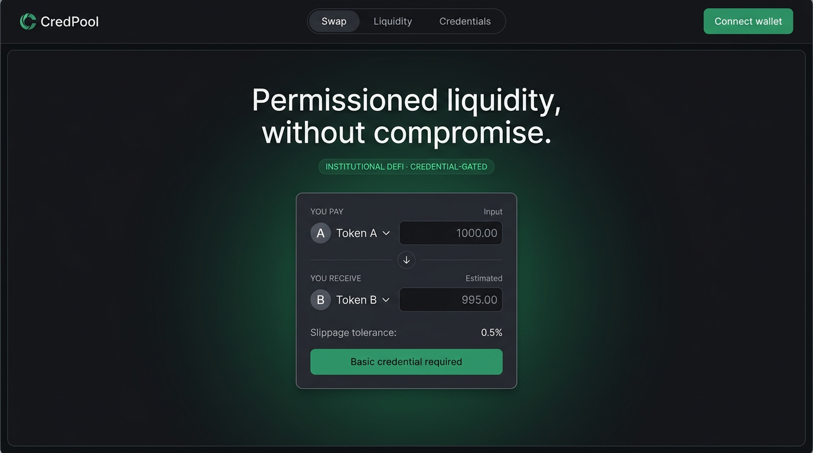

# CredPool — Credential-Gated DeFi Pools

A permissioned constant-product AMM where a W3C Verifiable Credential, a live on-chain credential record, and a soulbound ERC-1155 badge jointly control swaps and liquidity access.



## Highlights

- `did:pkh:eip155` identity derived from the connected wallet
- JWT VC issuance plus a chain/contract-bound EIP-712 attestation
- Active issuer and credential registries with immediate revocation
- Soulbound Basic, Pro, and Institutional ERC-1155 badges with EIP-5192/ERC-165 discovery and hosted metadata
- Constant-product AMM with a 0.30% configurable fee, slippage/deadline protection, rolling 24-hour tier limits, EIP-2612 permit swaps, locked initial liquidity, pause, `SafeERC20`, and reentrancy protection
- Holder-side AES-256-GCM encryption derived from a wallet signature; switchable local or real Pinata/IPFS persistence
- React/Vite frontend for verification, swaps, liquidity, and credential history
- Requirement-named Hardhat tests, Foundry fuzz/invariant tests, and Playwright wallet/verification/swap smoke tests

## Architecture

```text
React + ethers ── request ──> Issuer service ── JWT VC + EIP-712 signature
      │                              │
      │ encrypted VC                 │ issuer key from environment
      ▼                              ▼
content-addressed store       AccessBadge (ERC-1155)
                                      │
                              CredentialRegistry ── IssuerRegistry
                                      │ live validity
                                      ▼
                           GatedPool AMM ── GatedLP ERC-20
```

## Prerequisites

- Node.js 20+
- npm 10+
- A browser wallet for frontend use

## Quick start

```bash
cp .env.example .env
npm install
npm test
npm run test:issuer
npm run demo
```

`npm run demo` deploys every contract to an ephemeral local Hardhat chain, registers a demo issuer, claims a Pro badge, mints demo assets, and seeds liquidity in one command.

### Persistent local environment

Terminal 1:

```bash
npx hardhat node
```

Terminal 2:

```bash
npx hardhat run scripts/deploy.ts --network localhost
```

Copy the resulting addresses into `.env` and `frontend/.env`, set an issuer key that corresponds to an issuer registered by the admin, then run:

```bash
npm run issuer
npm run frontend
```

The mock KYC passcode used by the UI is `DEMO-PASS`. It is intentionally deterministic and is not real KYC.

## Commands

| Command | Purpose |
|---|---|
| `npm test` | Contract and on-chain integration suite |
| `npm run test:issuer` | VC issuance/encryption/storage and Pinata-adapter tests |
| `npm run test:frontend` | Frontend build plus Playwright connect/verify/swap smoke tests |
| `npm run test:foundry` | Foundry fuzz and invariant suite (requires Foundry) |
| `npm run coverage` | Solidity coverage report |
| `npm run gas` | Contract gas report |
| `npm run demo` | Deploy and seed an ephemeral local demo |
| `npm run deploy -- --network sepolia` | Deploy to Sepolia when environment credentials are supplied |
| `npm run verify:sepolia` | Verify a recorded Sepolia deployment on Etherscan |
| `npm --prefix frontend run build` | Type-check and build the frontend |

## Access policy

### Minimum credential tier by operation

| Operation | Minimum tier |
|---|---:|
| Swap | Basic (1) |
| Add liquidity | Pro (2) |
| Remove liquidity | Pro (2) |

### Default swap limit by credential tier

| Credential tier | Rolling 24-hour maximum |
|---|---:|
| Basic (1) | 1,000 token0-equivalent per rolling 24 hours |
| Pro (2) | 50,000 token0-equivalent per rolling 24 hours |
| Institutional (3) | Unlimited |

LP shares are transferable, but redemption is always subject to a live Pro-or-higher credential. While paused, swaps and deposits stop; verified withdrawals remain available.

## Credential privacy

Only a credential hash and non-personal access metadata are put on-chain. The service canonicalizes the VC payload before hashing. The holder signs a deterministic, account-and-chain-bound message in the browser; that signature derives a non-exportable AES-256-GCM key. Plaintext never reaches the storage endpoint. The encrypted blob can be stored by the deterministic local adapter or pinned to real IPFS through Pinata. Set `STORAGE_ADAPTER=pinata`, `PINATA_JWT`, and optionally `PINATA_GATEWAY_URL`. The holder signs again to decrypt a downloaded credential locally.

The issuer can optionally embed W3C Bitstring Status List entries (`STATUS_LIST_ENABLED=true`) for cheap off-chain revocation checks. On-chain pool access still uses immediate registry revocation. JWT credentials are verified through `did-jwt-vc` and DID resolution; `did:pkh` is the default and `did:ethr` can be enabled with `DID_METHOD=ethr`.

## Test status

- **46 Hardhat tests**, including every acceptance ID, rolling-volume bypass protection, permit swaps, and EIP-5192
- **6 issuer/API/storage tests**, including VC verification, revoke authentication, status lists, and the real Pinata adapter boundary
- **2 Playwright smoke tests** covering wallet connect, verification, and swap states
- Foundry: **512 fuzz cases** and **16,384 stateful invariant calls** for non-decreasing `k` and reserve backing
- **100% Solidity statements and lines; 95.05% branch coverage**
- Measured pool swap: **108,571 gas average** (102,717 minimum / 128,085 maximum), below the 130k target
- Frontend production build passes
- Local one-command demo passes

See [`docs/SECURITY.md`](docs/SECURITY.md), [`docs/GAS.md`](docs/GAS.md), and the normative [`docs/SPEC.md`](docs/SPEC.md).

## Production storage

```bash
STORAGE_ADAPTER=pinata
PINATA_JWT=your-fine-grained-pinata-jwt
PINATA_GATEWAY_URL=https://your-gateway.mypinata.cloud
```

`POST /storage/upload` accepts ciphertext only. `STORAGE_ADAPTER=local` remains the deterministic default for tests and local demos.

## Governance

Sepolia deployment requires `ADMIN_MULTISIG`. The deploy script creates `CredPoolTimelock`, assigns proposer/executor authority to that multisig, transfers registry and pool admin roles to the timelock, and renounces the deployer's admin roles. `TIMELOCK_DELAY` defaults to 86,400 seconds on Sepolia.

## Sepolia

No private key, RPC endpoint, or Etherscan API key is committed. Set `SEPOLIA_RPC_URL`, `DEPLOYER_PK`, and `ETHERSCAN_API_KEY`, run the Sepolia deployment, then run `npm run verify:sepolia`. The deployment command automatically records addresses under `deployments/sepolia.json`. No production/mainnet use is intended.

## License

MIT
